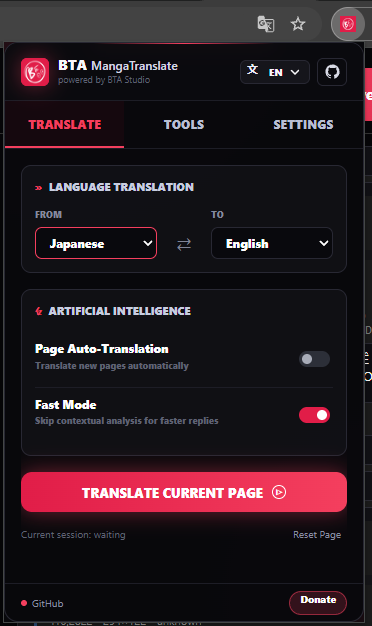
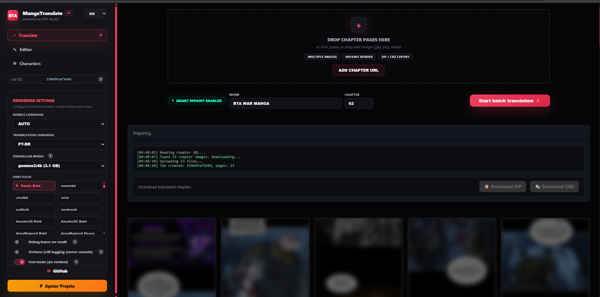
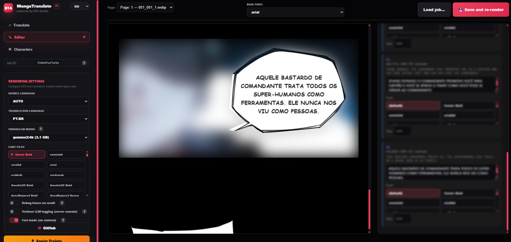
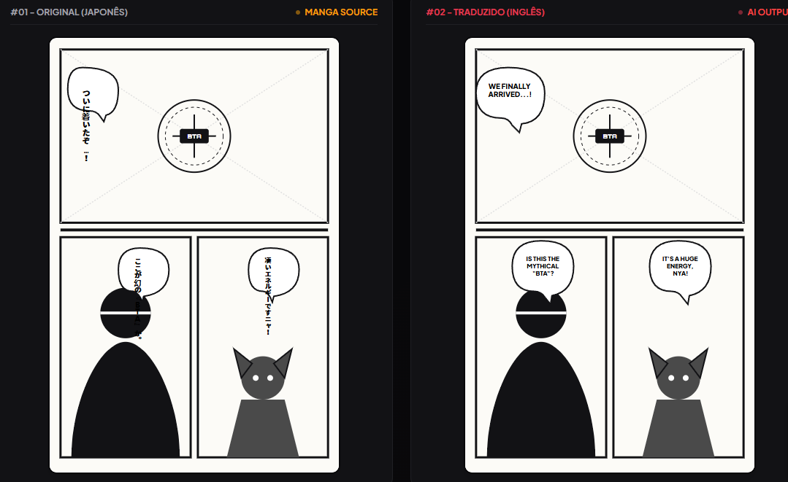

# BTA MangaTranslate

[](LICENSE)
[](https://www.python.org/downloads/)
[](https://fastapi.tiangolo.com/)
[](https://ollama.com/)

**BTA MangaTranslate** is a local manga translation tool with two workflows:

- **Chrome extension:** translates manga pages while you read, using live text overlays.
- **Backend web app:** uploads chapters, removes original text with inpaint, renders translated text inside bubbles, lets you edit, and exports ZIP/CBZ.

Everything runs locally through your own backend and Ollama. No cloud API key is required.

## Start Here

### 1. Chrome Extension: translate while reading

Use this when you are reading manga online and want quick live translation overlays.



How it works:

1. Start the backend with `run.bat`, `run.sh`, or `python setup.py`.
2. Open Chrome at `chrome://extensions`.
3. Enable **Developer mode**.
4. Click **Load unpacked** and select `chrome_extension/`.
5. Open a manga chapter page.
6. Use the BTA popup to translate the current page or enable auto-translation.

The extension sends visible page images to your local backend, receives OCR and translation results, then draws translated text as browser overlays. It does **not** permanently edit the source images.

### 2. Backend: translate full chapters with inpaint

Use this when you want rendered translated images, editing, and export.



Basic flow:

1. Open `http://localhost:8000/`.
2. Drop chapter images or click **Add chapter URL**.
3. Choose source language, target language, model, and font.
4. Click **Start batch translation**.
5. Edit any bubble if needed.
6. Export the result as ZIP or CBZ.

The backend removes the original text with inpaint and renders translated text inside the detected bubbles.

### 3. Editor: fix bubbles before export



The editor lets you:

- change translated text per bubble;
- change font per bubble or for the page;
- re-render the current page;
- inspect OCR text and bubble metadata;
- export the corrected chapter.

## Example Output



## Install

### Windows

```bat
run.bat
```

The launcher prepares the local Python environment, installs dependencies, checks Ollama, and opens the backend.

### Linux and macOS

```bash
chmod +x run.sh
./run.sh
```

### Manual

```bash
python -m venv venv
venv\Scripts\activate
pip install -r requirements.txt
python setup.py
```

On Linux/macOS:

```bash
python3 -m venv venv
source venv/bin/activate
pip install -r requirements.txt
python setup.py
```

## Requirements

- Windows 10/11, Linux, or macOS.
- Python 3.10 or newer.
- [Ollama](https://ollama.com/) running locally.
- At least one vision-capable Ollama model.
- Recommended OCR model: `glm-ocr`.
- GPU recommended for detection and inpaint. CPU works, but is slower.

Recommended models:

```bash
ollama pull gemma3:4b
ollama pull glm-ocr
```

Heavier alternatives:

```bash
ollama pull gemma3:12b
ollama pull llava:13b
ollama pull qwen2.5vl:7b
```

## What Each Mode Is For

| Workflow | Best for | Output |
|---|---|---|
| Chrome extension | Reading online | Live browser overlays |
| Backend Translate | Full chapter processing | Rendered images with inpaint |
| Backend Editor | Manual cleanup | Re-rendered corrected pages |
| Export | Sharing your own processed files | ZIP or CBZ |

## Key Features

- Local OCR and translation through Ollama.
- Speech bubble detection with RT-DETRv2.
- Backend inpaint rendering for clean translated pages.
- Chrome extension overlay mode for online reading.
- Batch chapter translation.
- Chapter URL import.
- Visual editor with per-bubble text and font controls.
- ZIP and CBZ export.
- Character archive for better chapter context.
- Default Comic Bold font alias with automatic fallback.

## Project Structure

```text
MangaTranslate/
  web.py                       FastAPI backend and extension API
  web_ui.html                  Backend web interface
  manga_translator.py          OCR, translation, inpaint, rendering pipeline
  setup.py                     Local launcher and environment checks
  requirements.txt             Python dependencies
  run.bat                      Windows launcher
  run.sh                       Linux/macOS launcher
  chrome_extension/            Chrome extension
  examples/                    README images and workflow examples
```

## Useful Details

<details>
<summary><strong>How the backend pipeline works</strong></summary>

```text
Chapter image
  |
  |-- detect bubbles and text regions
  |-- OCR each bubble
  |-- translate with local Ollama model
  |-- inpaint original lettering
  |-- fit translated text inside bubbles
  |-- save image, editor data, and export files
```

</details>

<details>
<summary><strong>How the extension pipeline works</strong></summary>

```text
Visible browser image
  |
  |-- send image to localhost backend
  |-- detect/OCR/translate bubbles
  |-- stream results back to Chrome
  |-- draw translated text overlays on the page
```

The extension is intentionally different from the backend. It is built for fast reading overlays, while the backend is built for final rendered output.

</details>

<details>
<summary><strong>Local data folders</strong></summary>

Generated data stays local:

| Path | Purpose |
|---|---|
| `web_data/` | Uploads, translated pages, jobs, exports |
| `characters.json` | Character archive |
| `models/huggingface/` | Local Hugging Face cache |
| `crops/` | OCR/debug crops |
| `errors.log` | Processing issues |

These paths are ignored by Git.

</details>

<details>
<summary><strong>Main API routes</strong></summary>

| Route | Purpose |
|---|---|
| `/` | Backend web UI |
| `/api/models` | List Ollama models |
| `/api/upload` | Create a chapter job |
| `/ws/{job_id}` | Live backend progress |
| `/api/job/{job_id}` | Load job data |
| `/api/job/{job_id}/page/{page_idx}/render` | Re-render edited page |
| `/api/job/{job_id}/export?fmt=zip` | Export ZIP |
| `/api/job/{job_id}/export?fmt=cbz` | Export CBZ |
| `/api/translate-image-bubbles-stream` | Extension streaming overlay endpoint |

</details>

## Troubleshooting

<details>
<summary><strong>Ollama is not detected</strong></summary>

Check Ollama:

```bash
ollama list
```

Then pull the recommended models:

```bash
ollama pull gemma3:4b
ollama pull glm-ocr
```

</details>

<details>
<summary><strong>The extension does not translate a page</strong></summary>

Check that:

- the backend is running at `http://localhost:8000/`;
- the extension was loaded from `chrome_extension/`;
- the reader page uses normal image elements;
- the site is not blocking overlays or image access.

</details>

<details>
<summary><strong>Text does not fit perfectly</strong></summary>

Use the backend editor, adjust the bubble text or font, then click **Save and re-render**. Very dense text, vertical lettering, credits pages, or unusual balloon shapes may still need manual cleanup.

</details>

<details>
<summary><strong>Inpaint is slow</strong></summary>

Use an NVIDIA GPU when possible. The launcher checks for CUDA and can install the CUDA PyTorch wheel automatically. CPU mode works, but full chapter rendering is slower.

</details>

## Privacy

BTA MangaTranslate is local-first:

- pages are processed on your machine;
- translation calls go to local Ollama at `localhost:11434`;
- the backend runs at `localhost:8000` unless you expose it yourself.

Network access is used for first-time dependency and model downloads.

## Responsible Use

BTA MangaTranslate is provided as a local personal tool. You are responsible for
the material you translate, store, share, publish, or redistribute with it.
Use it only for content you own, have purchased, or have permission to process,
and do not use it to bypass copyright, licensing, or distribution rights.

The authors and contributors are not responsible for improper, illegal, or
unauthorized use of the tool or for third-party content processed by users.

## Credits

BTA MangaTranslate builds on excellent open-source work:

- [Ollama](https://ollama.com/) for local model serving.
- [PyTorch](https://pytorch.org/) for model inference.
- [Transformers](https://github.com/huggingface/transformers) for RT-DETRv2 loading.
- [Hugging Face Hub](https://huggingface.co/) for model downloads.
- [anime-big-lama](https://huggingface.co/df1412/anime-big-lama) for manga-style inpainting.
- [RT-DETR](https://github.com/lyuwenyu/RT-DETR) and comic bubble detection weights for speech bubble detection.
- [FastAPI](https://fastapi.tiangolo.com/) for the backend.

## Support

- GitHub: [JpAndreBTA/BTA-Manga-Translator](https://github.com/JpAndreBTA/BTA-Manga-Translator)
- Donate: [PayPal donation page](https://www.paypal.com/donate/?hosted_button_id=H33M9F9S2MZ38)

## License

BTA MangaTranslate is free for non-commercial use only. Commercial use, resale,
paid hosting, paid service integration, and monetized redistribution require
prior written permission from BTA Studio. See [LICENSE](LICENSE).
